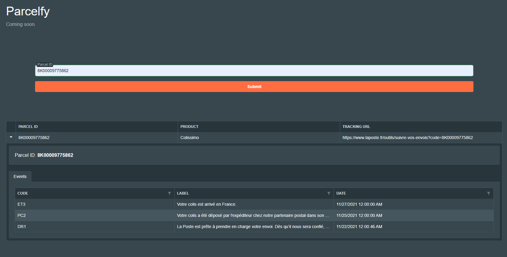

# <p align="center">Parcelfy</p>
  
  
Welcome to "**Parcelfy**" - your one-stop solution for tracking parcels from the largest carriers in France. The app is designed to provide a seamless experience for monitoring the delivery status of your packages. 


## 🚧 Under Construction
The app is currently in its early stages, and we are actively working to expand our carrier support. <br/>
Presently, Parcelfy supports tracking for :
[La Poste](www.laposte.fr),
[Chronopost](www.chronopost.fr) and
[Colissimo](www.colissimo.fr)<br/>
The future vision is to include support for all major carriers, ~~both domestic and international~~. In the upcoming releases, we plan to support tracking for: 
[Dhl](www.dhl.com),
[Ups](www.ups.com) 
and [Fedex](www.fedex.com) <br/>
Stay tuned.


[](https://github.com/TheoImadLadal/parcelfy/actions/workflows/buildAndDeploy.yml)
[](https://github.com/TheoImadLadal/parcelfy/actions/workflows/unitTestCoverage.yml)
[](https://github.com/TheoImadLadal/parcelfy/actions/workflows/codeql.yml)
[](https://dashboard.stryker-mutator.io/reports/github.com/TheoImadLadal/parcelfy/main)
[](https://github.com/TheoImadLadal/parcelfy/actions/workflows/specflow.yml)


## 🧐 Features    
- **Unified Tracking**: Enjoy the convenience of tracking all your parcels from different carriers on a single page.
- **Real-time Updates**: Real-time updates about the status of your parcels.

   
        
## 🛠️ Tech Stack

**FRONTEND** *~~Coming soon~~*

* [x] [BLAZOR](https://dotnet.microsoft.com/en-us/apps/aspnet/web-apps/blazor) - FRONTEND - Hosted in this Github Repo : [Parcelfy-Blazor](https://github.com/TheoImadLadal/parcelfy-blazor)
* [ ] [REACT](https://react.dev/) - FRONTEND - Hosted in this Github Repo : [Parcelfy-React](https://github.com/TheoImadLadal/parcelfy-react)

**BACKEND**

* [x] [ASP.NET Core 8](https://docs.microsoft.com/en-us/aspnet/core/introduction-to-aspnet-core) - (Latest release - Available since Novembre 2023)
* [ ] [HealthChecks](https://learn.microsoft.com/en-us/aspnet/core/host-and-deploy/health-checks?view=aspnetcore-8.0)
* [X] [Authentication API JWT](https://www.nuget.org/packages/Microsoft.AspNetCore.Authentication.JwtBearer/6.0.6) 
* [ ] [Polly](https://github.com/App-vNext/Polly) - Retry policy 
* [x] [Mapster](https://github.com/MapsterMapper/Mapster) - Auto mapping
* [x] [FluentValidation](https://fluentvalidation.net/) - Model validation
* [x] [NUnit](https://nunit.org/), [FluentAssertions](https://fluentassertions.com/), [Moq](https://github.com/moq) - Unit testing
* [X] [Stryker testing](https://stryker-mutator.io/) - Mutation testing
* [X] [Specflow BDD](https://specflow.org/) - Behaviour testing


 
**DATABASE**
* [x] [EF CORE 6](https://learn.microsoft.com/fr-fr/ef/core/what-is-new/ef-core-6.0/whatsnew) / [Npgsql](https://www.npgsql.org/)
* [x] ~~[Azure SQL Database](https://azure.microsoft.com/fr-fr/products/azure-sql/database/)~~ - Old
* [x] [POSTGRESql](https://www.postgresql.org/) - New

**ARCHITECTURE** 
* [x] [Hexagonal Architecture](https://en.wikipedia.org/wiki/Hexagonal_architecture_(software))
* [x] [REST](https://restfulapi.net/)
* [ ] [GraphQL](https://graphql.org/)


*And more to come.*    
     

## ➤ References 

### Front (Blazor) : https://parcelfy-blazor.azurewebsites.net/


### API Doc : https://parcelfy.azurewebsites.net/swagger/index.html
#### Get tracking details by parcelId
```http
GET /parcel-tracker/{parcelId}
```
| Parameter | Type     | Description                       |
| :-------- | :------- | :-------------------------------- |
| `parcelId` **Required**. | `string` |  Your parcel Id |
        
   
        
## 🙇 Acknowledgements      


### Core Layer:
- Defines domain entities, value objects, validators, and business logic independent of infrastructure choices.
- Ensures clean separation of concerns and reusability of core concepts.

### Application Layer:
- Orchestrates business logic using core domain concepts.
- Defines use cases for specific application functionalities.
- Decouples core logic from infrastructure and presentation details.

### Infrastructure Layer:
- Provides concrete implementations for persistence, external service interactions, and other technical concerns.
- Uses interfaces to connect with the application layer and maintain testability.
- Separates infrastructure details from core logic and application functionalities.

### API Layer (Controllers):
- Handles routing, request/response parsing, and presentation-related concerns.
- Calls application use cases for business logic execution.
- Focuses on API design and user interaction without implementing core logic.

        
